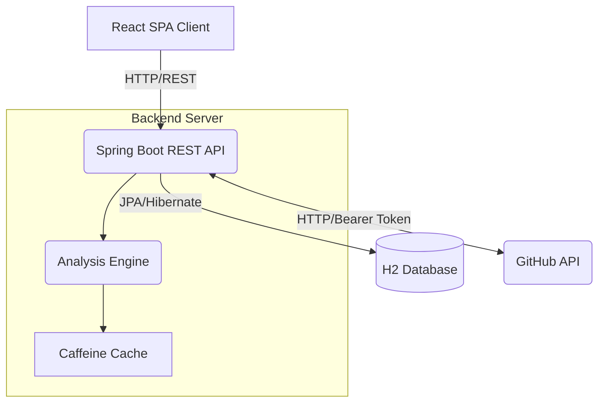
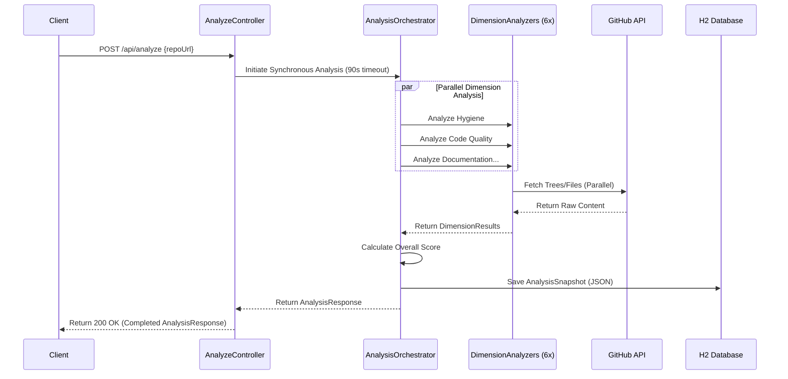
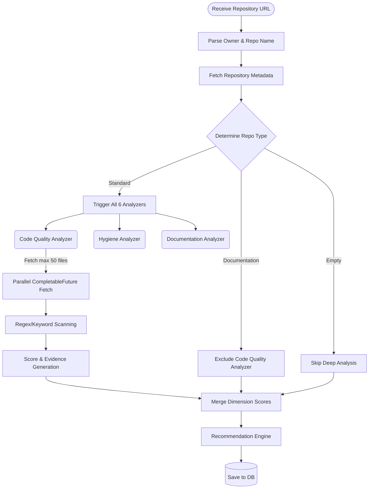
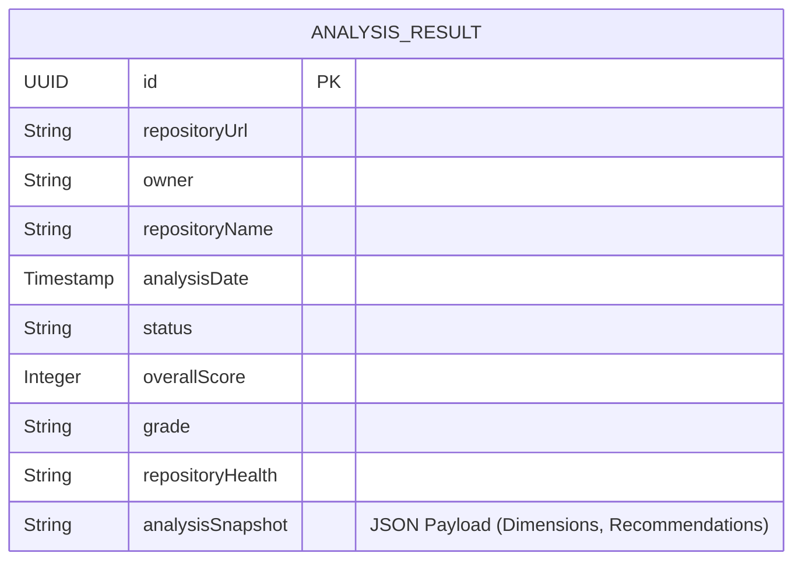

# 🏛️ RepoDoctor Architecture Documentation

This document outlines the high-level system architecture, data flows, and internal pipelines powering RepoDoctor.

---

## 1. High-Level System Architecture

RepoDoctor is built using a decoupled Client-Server architecture. The frontend is a Single Page Application (SPA) served via a lightweight development server or CDN, communicating with a backend REST API built on Spring Boot. The backend orchestrates external requests to the GitHub API, caches responses, analyzes data concurrently, and persists analysis results to a file-based H2 database.

---

## 2. Backend Data Flow

The Spring Boot backend is divided into several layers to enforce separation of concerns:
- **Controllers:** Handle HTTP requests and input validation.
- **Services:** Execute business logic and orchestrate analysis tasks.
- **Analyzers:** Specialized classes evaluating specific dimensions (e.g., Code Quality, Structure).
- **Repositories:** Interfaces interacting with the PostgreSQL database.

---

## 3. Analysis Engine Pipeline

RepoDoctor's core is the Analysis Engine. To handle large repositories without hitting API timeouts, the engine employs dynamic weight redistribution and asynchronous file fetching.

---

## 4. Database Schema

The database uses a NoSQL-in-SQL approach. While relational structures are used for indexing, the complex, highly dynamic analysis results are stored as a JSON string snapshot to allow maximum flexibility without rigid schema migrations.

