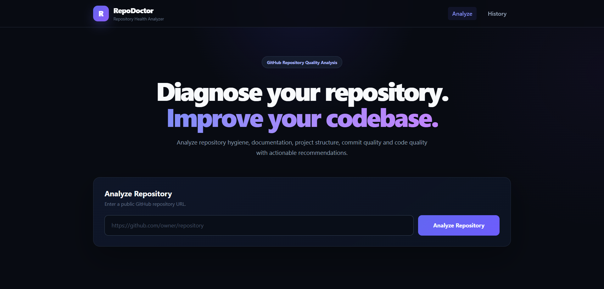
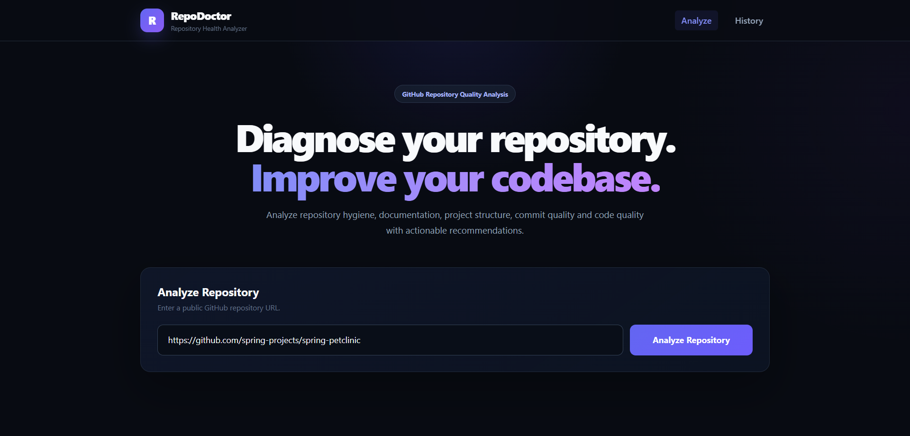
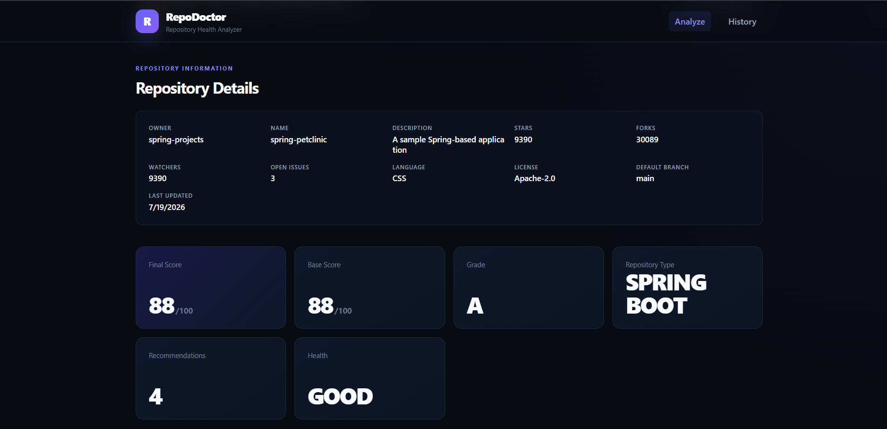
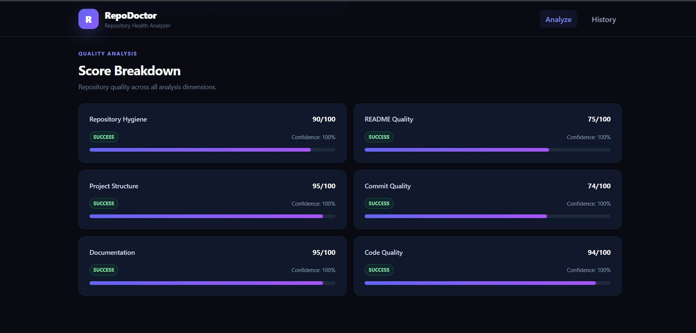
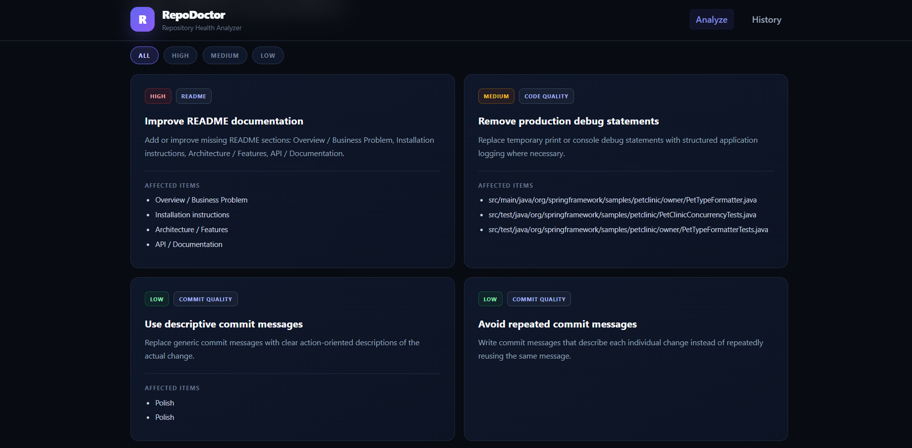
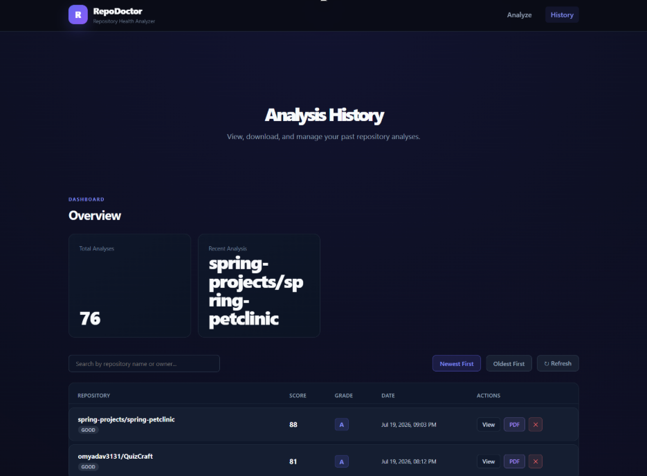

<div align="center">

# 🩺 RepoDoctor
**The Ultimate GitHub Repository Quality Analysis & Recommendation Platform**

[](https://java.com/)
[](https://spring.io/projects/spring-boot)
[](https://reactjs.org/)
[](https://h2database.com/)
[](https://opensource.org/licenses/MIT)

*A comprehensive automated code auditor designed to evaluate repository structure, code hygiene, README quality, and project health, producing actionable recommendations and professional PDF reports.*

---

### 📸 Application Showcase

<div align="center">
  
  <br><br>
  
  <br><br>
  
  <br><br>
  
  <br><br>
  
  <br><br>
  
</div>

---
</div>

## 📌 Project Overview
**RepoDoctor** is an advanced, full-stack application that seamlessly analyzes public and private GitHub repositories without the overhead of cloning. Leveraging the GitHub REST API and advanced concurrent fetching pipelines, RepoDoctor dissects project structures across 6 core dimensions, handles sparse or README-only repositories gracefully, and provides developers with a concrete, data-driven improvement plan.

Built with **Spring Boot** and **React**, this project demonstrates deep architectural design, rapid third-party API integration, robust background processing, and modern UI/UX principles.

## ✨ Features
- **Zero-Clone Analysis:** Rapidly audits repositories entirely in-memory using the GitHub API.
- **Multi-Dimensional Scoring:** Evaluates projects across 6 distinct metrics: *Code Quality, Project Structure, Commit Quality, Documentation, Hygiene, and README*.
- **Dynamic Weighting Engine:** Intelligently redistributes score weights for edge-cases like README-only, empty, or documentation-centric repositories to prevent inaccurate penalties.
- **Parallel File Fetching:** Uses asynchronous, non-blocking `CompletableFuture` streams to process thousands of lines of code in seconds.
- **Actionable Recommendations:** Generates specific, prioritized tasks (e.g., *“Add inline comments to 4 undocumented files”*, *“Remove 2 detected hardcoded API keys”*).
- **PDF Report Generation:** One-click generation of professional analysis reports with embedded analytics charts via OpenPDF and JFreeChart.
- **History & Analytics Dashboard:** A sleek, dark-mode React UI to view past analyses, browse grades, and review metric breakdowns.

---

## 🏗️ Architecture Overview

The platform uses a layered client-server architecture:
1. **Frontend Layer:** A modern Single Page Application (SPA) built with React and Vite, utilizing Axios for API communication.
2. **Backend API Layer:** A robust Spring Boot REST API that handles orchestrations, asynchronous file fetching timeouts, and data validation.
3. **Analysis Engine:** Core business logic consisting of dedicated services (e.g., `CodeQualityAnalyzerService`) that parse GitHub structures in parallel.
4. **Data Layer:** File-based H2 database mapped via JPA/Hibernate to persist historical analysis snapshots as JSON payloads.

*(See [ARCHITECTURE.md](ARCHITECTURE.md) for detailed Mermaid diagrams and system flows).*

---

## 🚀 Benchmark Results

RepoDoctor has been heavily optimized with evidence-based scoring and parallel processing. Execution time scales dynamically with the size of the repository.

- **Standard Repositories:** ~4-10 seconds
- **Sparse/Empty Repositories:** ~1-2 seconds
- **Massive Enterprise Repositories:** Processing is constrained by a strict 90-second timeout, with top 50 files sampled per dimension to prevent GitHub API rate limits.

---

## 🛠️ Technology Stack

### Backend
- **Java 21** & **Spring Boot 3.5**
- **Spring Data JPA** & **Hibernate**
- **Caffeine Cache** (Performance optimization)
- **OpenPDF** & **JFreeChart** (PDF generation)
- **H2 Database** (File-based storage)

### Frontend
- **React 18** & **Vite**
- **Vanilla CSS** (Custom, modern dark-mode design system)
- **Axios** (API Requests)
- **Lucide React** (Iconography)

---

## ⚙️ Installation & Setup Guide

Ensure you have **Java 21** and **Node.js 18+** installed on your system.

### 1. Environment Variables
The application relies strictly on environment variables for security. You must configure these before running the backend. 

Create a `.env` file or export the following in your terminal:
```bash
# GitHub API Configuration (Required for higher rate limits and private repos)
export GITHUB_TOKEN="ghp_your_github_personal_access_token"
```

### 2. Running the Backend
Navigate to the `repodoctor` backend directory and start the Spring Boot application using Maven Wrapper:

```bash
cd repodoctor
./mvnw clean package -DskipTests
./mvnw spring-boot:run
```
*The backend will automatically create the required H2 database file in `./data/repodoctor` and start on `http://localhost:8080`.*

### 4. Running the Frontend
Navigate to the frontend directory, install dependencies, and start the Vite development server:

```bash
cd repodoctor-frontend
npm install
npm run dev
```
*The frontend will start on `http://localhost:5173`. Open this URL in your browser to access the dashboard.*

---

## 📚 Documentation
- **[API Documentation](API_DOCUMENTATION.md)**: Complete REST API specifications.
- **[Architecture Guide](ARCHITECTURE.md)**: System design and data flow diagrams.
- **[Screenshot Guide](SCREENSHOT_GUIDE.md)**: Visual breakdown of the application interfaces.

---

## 🔮 Future Scope
- **Webhooks Integration:** Automatically trigger repository analysis when a pull request is merged on GitHub.
- **Language-Specific AST Parsing:** Deep-dive abstract syntax tree parsing to identify code smells.
- **AI-Powered Code Reviews:** Integrate LLMs to suggest exact code rewrites for poorly documented files.

## 🤝 Contributing
Contributions are welcome! Please ensure that you do not commit any secrets (like database passwords or GitHub tokens). Verify that your code passes all linting rules (`npm run lint` in the frontend and `./mvnw verify` in the backend) before submitting a pull request.

## 📄 License
This project is licensed under the [MIT License](LICENSE).

---
<div align="center">
<i>Developed by Om Nandkishor Yadav.</i>
</div>
